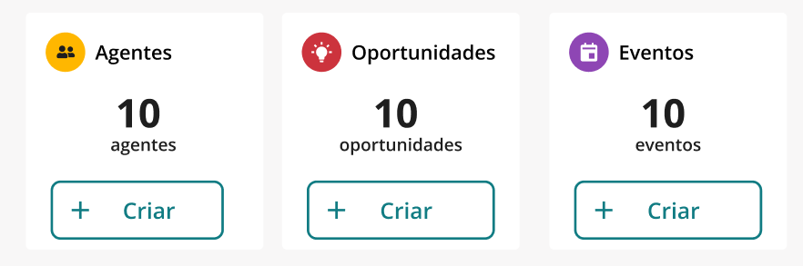
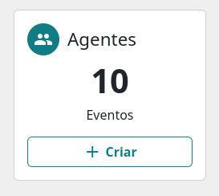
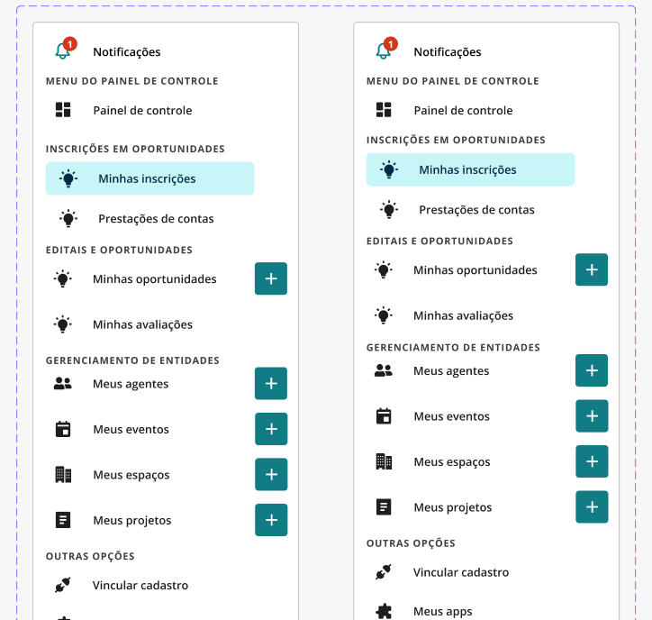
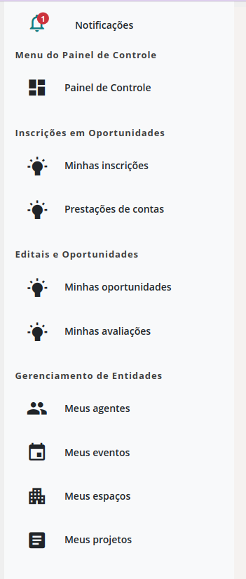

# Documentação de Decisões de Design - Mapinha Material Design

Este documento visa registrar e justificar as principais decisões de design tomadas durante o desenvolvimento da interface do Mapinha utilizando Material Design. Cada componente modificado ou adicionado será descrito com detalhes, incluindo o raciocínio por trás das mudanças.

## Sumário

- [Card](#1-card)
- [Sidebar](#2-sidebar)

## Componentes

### 1. Card

#### 1.1. Problema Identificado

Foi observado que o botão e seu ícone no Card estavam seguindo um estranho padrão de centralização, o que causava uma inconsistência visual quando estamos trabalhando com a responsividade.

#### 1.2. Análise da Versão Atual

A versão inicial, conforme apresentada no Figma, mostrava o botão e o ícone com essas proporções, quando trazemos a aplicação:

> **Figura 1:** Versão do Figma com proporções irregulares.

#### 1.3. Modificação Proposta

Para resolver o problema, decidimos alinhar o botão e o ícone ao centro do card, conforme os princípios do Material Design. Essa alteração garante uma aparência mais consistente e alinhada com o restante da interface.

> **Figura 2:** Versão final com alinhamento corrigido.

#### 1.4. Justificativa

O alinhamento central foi escolhido para criar um visual mais harmonioso e melhorar a experiência do usuário, garantindo que os elementos no card estejam equilibrados e visualmente agradáveis.

-------------------

### 2. Sidebar

#### 2.1. Problema Identificado

Durante o desenvolvimento de nossa aplicação web, recebemos os layouts das telas através do Figma, elaborados pela equipe de design. No entanto, ao longo do processo de implementação, identificamos que certos elementos propostos no layout original eram desnecessários ou inadequados para a experiência do usuário, especialmente para públicos específicos, como pessoas idosas ou com deficiências.

#### 2.2. Análise da Versão Atual

A versão inicial, conforme apresentada no Figma, incluía botões verdes com o símbolo de "+" localizados na lateral do componente sidebar. Embora visualmente atraente, esse design apresentou problemas de usabilidade.

> **Figura 1:** Versão do Figma com botões de ação no menu sidebar.

#### 2.3. Modificação Proposta

Optamos por remover os botões verdes com o símbolo de "+" da lateral do componente sidebar.

> **Figura 2:** Versão final com a remoção dos botões de ação.

#### 2.4. Justificativa

1. **Acessibilidade e Usabilidade**:
  - **Usuários com Deficiências**: Para usuários com deficiências, como baixa visão ou dificuldades cognitivas, o significado dos botões verdes "+" pode não ser claro. Esses usuários podem interpretar erroneamente o botão como uma função de expansão de menu, ao invés de uma ação de cadastro de novos itens.
  - **Público Idoso**: Usuários mais velhos, que podem não estar tão familiarizados com interfaces modernas, também podem ter dificuldades em entender a funcionalidade desses botões, levando a confusão e frustração.

2. **Confusão Funcional**:
  - **Interpretação Errônea**: A presença do símbolo "+" ao lado dos itens do menu sugere uma expansão de submenu, uma convenção comum em interfaces, mas que não reflete a funcionalidade desejada (cadastro de novos itens).
  - **Impacto na Navegação**: Essa ambiguidade pode prejudicar a navegação e a experiência do usuário, que pode clicar no botão esperando uma ação diferente da pretendida.

3. **Alinhamento com as Melhores Práticas de Design**:
  - **Consistência de Interface**: Seguindo as melhores práticas de design, botões que realizam ações como criar ou adicionar itens devem estar em locais mais intuitivos e destacados, como na parte superior de uma seção ou painel, e não em locais que possam ser confundidos com ações de navegação.
  - **Simplificação do Layout**: A remoção desses botões contribui para um layout mais limpo e menos sobrecarregado, focando na simplicidade e clareza, o que é particularmente importante para uma base de usuários diversificada.

## Referências

- [Material Design Guidelines](https://material.io/design/)

## Conclusão

As alterações documentadas neste arquivo visam melhorar a consistência visual e a experiência do usuário no Mapinha. Continuaremos a monitorar o impacto dessas mudanças e faremos ajustes conforme necessário.
